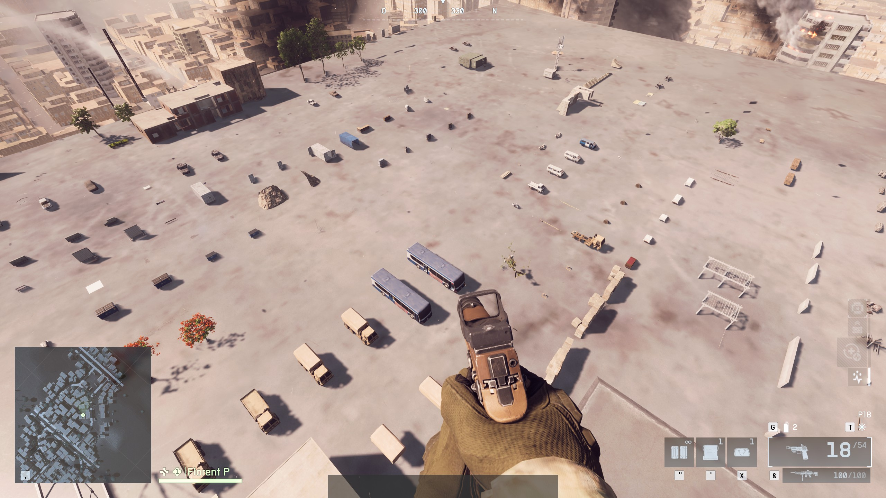

# Battlefield 6 Assets Library maps

Since we can only see the general shape of assets in Godot, this project contains each maps 
with each assets specific to them laid out in a grid, with the exclusion of SFX (sounds) and VFX (special effects).

Some big assets may also have been excluded (see their each map's scripts to see which).

All objects should float a little above the ground. Those who don't thus have physics.

An icon in the 3D world as well a UI element in the bottom center show you the name of the closest asset.

Some may be published, look for "assets library" in the in-game Portal server browser.    
The experiences are only meant to be hosted locally and with a single player.

## Sources

This repo contain all the sources necessary to develop and rebuild the experiences.

The `godot` folder contains the maps .tscn files, they are basically just the bases ones, with an added very big floor and the HQ moved there.  
The `src` folder contains the source of the scripts, that are concatenated with the `tools/build.sh` script.

### Build the .strings.json file

Copy from the `index.d.ts` file the list of cases from one of the `RuntimeSpawn_*` enum.  
Then do a search/replace with regex: search for `\w+(.+),`, and replace by `  "$1": "$1",` (works in Webstorm at least).

## Create an experience for yourself

The `portal` folder contain the three assets (`*.spatial.json`, `*.ts`, `*.strings.json`) that must be uploaded when building a Portal experience.
